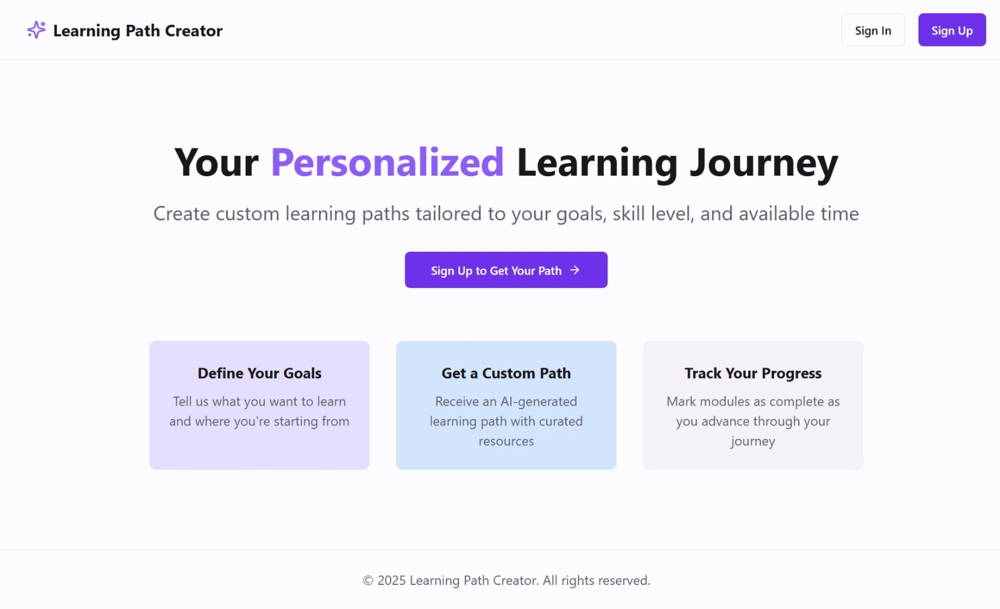
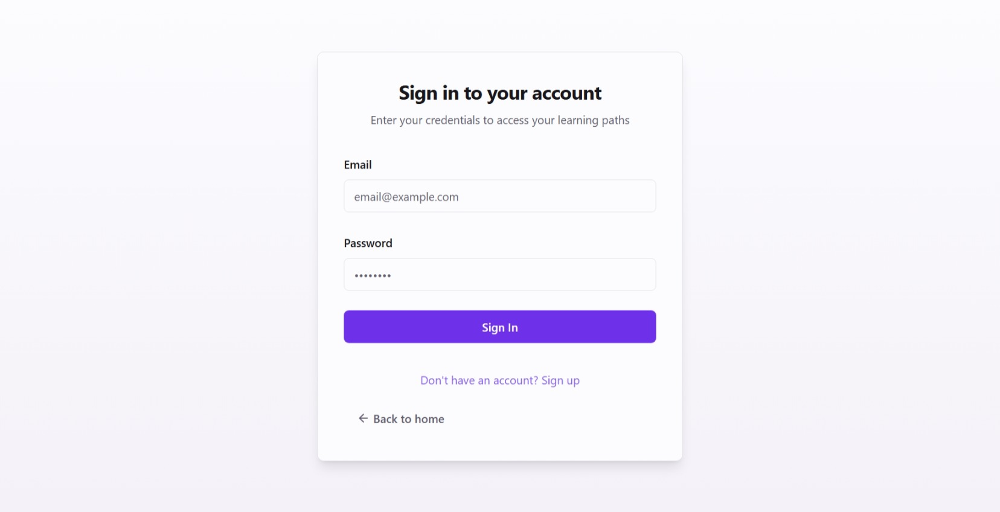
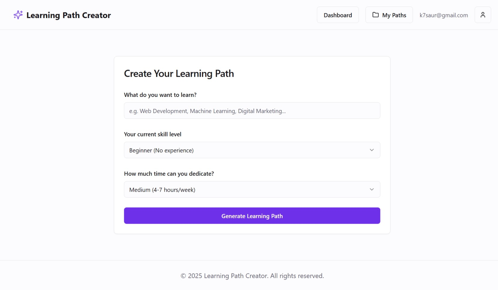
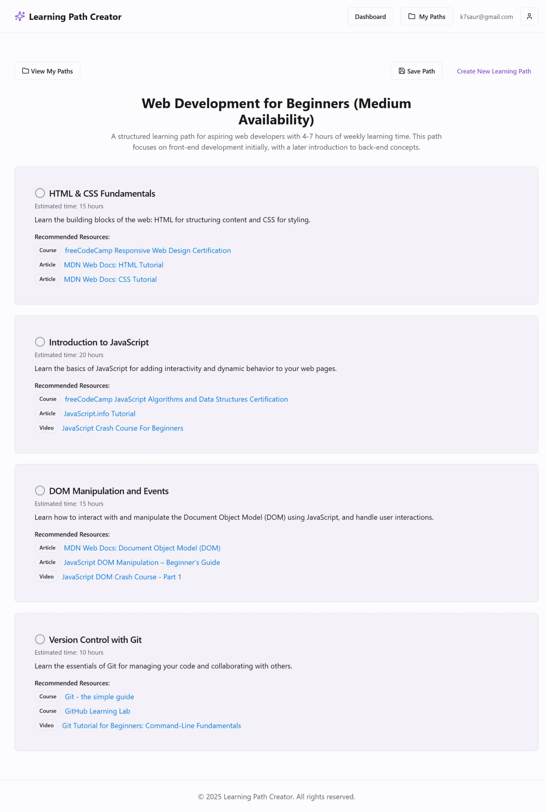
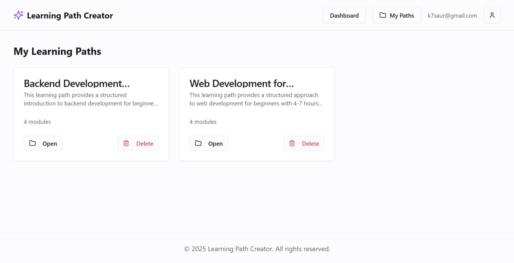
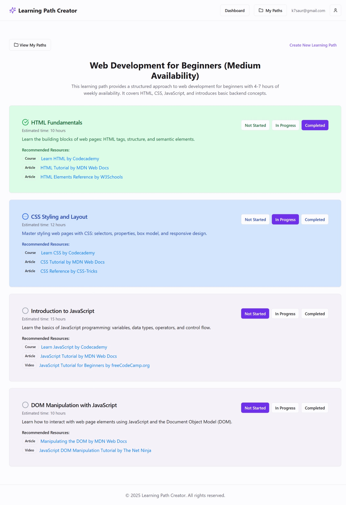

# Learning Path Creator

An AI-powered web app that creates personalized learning paths based on users' goals, skill levels, and time availability. User can create profile using email and generate structured learning modules with resources using AI. Users can track their progress and saves multiple learning journeys.

It is built with React and Tailwind CSS frontend, Supabase backend for authentication and data storage, and Google's Gemini AI API.

## [App Screenshots]


This is the landing page of this Web App. Here we have described the purpose of the Web App.


On this page user can Sign In/Up with their email address and password.


On this page user can provide their learning goal, time avaibility, and skill level to generate learning paths.


This page displays the learning path generated by the AI, user can save this path to start learning.


User can view and manage thier saved path here.


On this page, user can track their learing progress and mark a module as Started or In Progress or Completed.

## [Live Demo]
URL: https://learning-path-creator.vercel.app/

## Features

- **AI-Generated Learning Paths**: Create tailored learning paths with detailed modules and resources based on your goals, skill level, and available time
- **User Authentication**: Secure email-based login and registration
- **Progress Tracking**: Mark modules as "Not Started," "In Progress," or "Completed"
- **Path Management**: Save, view, and delete multiple learning paths
- **Responsive Design**: Fully functional on both desktop and mobile devices

## Technology Stack

- **Frontend**:
  - React with TypeScript
  - Tailwind CSS for styling
  - shadcn/ui component library
  - React Router v6 for navigation
  - React Query for data fetching and caching

- **Backend**:
  - Supabase for authentication and database
  - PostgreSQL database (via Supabase)

- **AI Integration**:
  - Google Gemini API for learning path generation

## Installation and Setup

### Prerequisites
- Node.js (v14.0.0 or later)
- npm or yarn
- Supabase account
- Google Gemini API key

### Installation Steps

1. Clone the repository
   ```bash
   git clone [YOUR INPUT NEEDED: your-repo-url]
   cd learning-path-creator
2. Install dependencies
   ```bash
   npm install
3. Set up environment variables
   ```bash
   Create a .env file in the root directory

   Add the following variables:
   VITE_SUPABASE_URL=your_supabase_project_url
   VITE_SUPABASE_ANON_KEY=your_supabase_anon_key
   VITE_GEMINI_API_KEY=your_gemini_api_key
4. Run the development server
   ```bash
   npm run dev
5. Open http://localhost:5173 with your browser to see the result.

## How to Use the Web App

### Creating an Account
1. Navigate to the application
2. Click on "Sign Up" in the navigation menu
3. Enter your email and create a password

### Creating a Learning Path
1. Log in to your account
2. On the dashboard, fill out the learning goal form:
   * Enter your learning goal
   * Select your current skill level
   * Choose your time availability
3. Click "Generate Learning Path"
4. Review the AI-generated learning path with its modules and resources
5. Save it for tracking the progress

### Tracking Progress

1. For each module in your learning path, you can mark it as:
   * Not Started (default)
   * In Progress
   * Completed
2. The app will save your progress automatically

### Managing Multiple Paths
1. Save your current path by clicking "Save Path"
2. View all your saved paths by clicking "View My Paths"
3. Select any saved path to view details or continue learning
4. Delete paths you no longer need

## Project Structure

```
src/
├── components/         # UI components
├── contexts/           # React contexts for state management
├── hooks/              # Custom React hooks
├── lib/                # Utility functions and API services
├── pages/              # Application pages/routes
└── ...
```

## Credits and Acknowledgments

